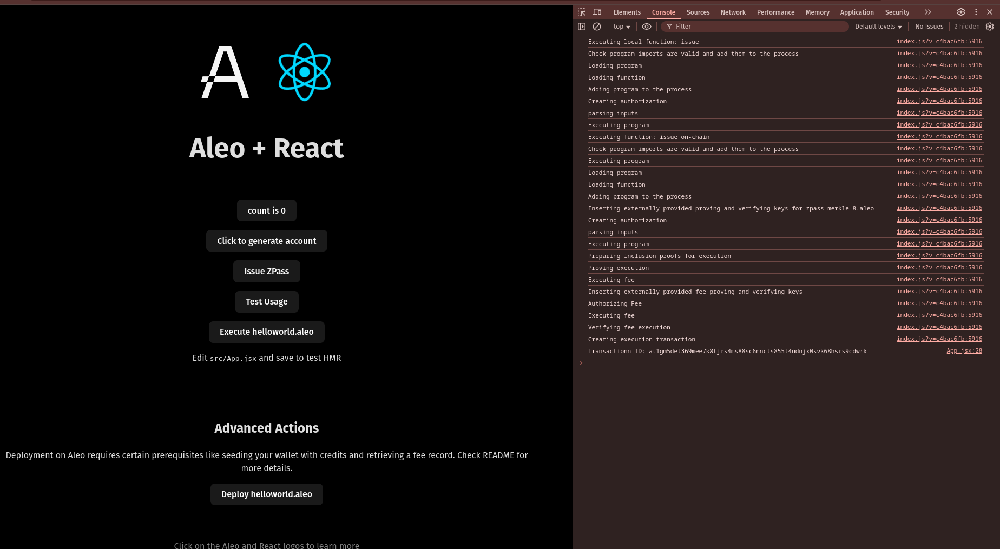

# ZPass Integration

## Create React Leo App:
- Command:
    ```sh
    npm create leo-app@latest
    ```
    
    <details><summary> Detailed Output </summary><blockquote>

    ~~~sh
    > npx
    > create-leo-app

    ✔ Project name: … sandabgc_leo_zpass_integration
    ✔ Select a framework: › React
    ✔ Select a variant: › JavaScript + Leo

    Scaffolding project in sandabgc_leo_zpass_integration...

    Done. Now run:

    cd sandabgc_leo_zpass_integration
    npm install
    npm run dev
    ~~~

    </blockquote></details>

- Install Dependencies:
    ```sh
    npm i zpass-sdk vite-plugin-wasm
    ```

## Modify Code:
- Add below code in `workers/worker.js`:
    ```js
    import { ZPassSDK } from "zpass-sdk";

    async function issueZPass(privateKey, inputs) {
    const zpass = new ZPassSDK({
        privateKey,
        host: "https://api.explorer.provable.com/v1",
        network: "testnet"
    });

    const account = new Account({privateKey});
    const issuer = account.address().to_string(); 

    const merkleRoot = await zpass.getMerkleRoot(inputs);
    const leaveHashes = await zpass.getLeavesHashes(inputs);
    const leaveHashesString = `[${leaveHashes.join(",")}]`
    const sig = await zpass.signMerkleRoot(merkleRoot);

    const txId = await zpass.issueZPass({
        programName: "zpass_merkle_8.aleo",
        functionName: "issue",
        inputs: [sig, leaveHashesString, issuer],
        fee: 0.1,
        privateFee: false
    }) ;

    return txId;
    }

    ...
    const workerMethods = { localProgramExecution, getPrivateKey, deployProgram, issueZPass };

    ```

- Add below code in `App.jsx`:
    ```jsx
    import { Account } from "@provablehq/sdk";

    function App() {
        ...
        ...

        const issueZPass = async () => {
        const privateKey = "<redacted>";
        const account = new Account({privateKey});
        const address = account.address().to_string();

        const inputs = [
        address,
        "1234u128",
        "547548i32"
        ]

        const txId = await aleoWorker.issueZPass(privateKey, inputs);
        console.log("Transactionn ID: " + txId);
    }

    ...
    ...
    return (
        ...
        <p>
        <button onClick={issueZPass}>
            {"Issue ZPass"}
        </button>
        </p>
    )
    ```

- Update `vite.config.js` with below code:
    ```js
    import { defineConfig } from "vite";
    import react from "@vitejs/plugin-react";
    import wasm from "vite-plugin-wasm"

    // https://vitejs.dev/config/
    export default defineConfig({
    plugins: [react(), wasm()],
    assetsInclude: ['**/*.wasm'],
    optimizeDeps: {
        exclude: ["@provablehq/wasm"],
    },
    server: {
        headers: {
        "Cross-Origin-Opener-Policy": "same-origin",
        "Cross-Origin-Embedder-Policy": "require-corp",
        },
    },
    });
    ```

## Start Project:
- Command:
    ```sh
    npm run dev
    ```
- Then, visit [http://localhost:5173](http://localhost:5173).

    

- Click in `Issue ZPass` Button:
    


- Here, in my case Transaction ID: `at1gm5det369mee7k0tjrs4ms88sc6nncts855t4udnjx0svk68hsrs9cdwrk`

## Sign with `Transaction ID`:
- For me, program deployed Transaction ID is: `at1gm5det369mee7k0tjrs4ms88sc6nncts855t4udnjx0svk68hsrs9cdwrk`. Command:
    ```sh
    leo account sign -d --private-key <redacted> --message "at1gm5det369mee7k0tjrs4ms88sc6nncts855t4udnjx0svk68hsrs9cdwrk" --raw
    ```
- Output:
    ```sh
    sign1jzxqdkrmugtke6tvuzxvymt8vtm74vmwkx4qdqhvegyesl6znup572a6dd2tlgnu7cqlarmvk73n4ey9f52hckkxwzus6cxxxl7ayq4zagrt29qtpw7qxv39ajtn8yxgyk093n6ah79jvpv2l3kfnalnz9kryey36lgje05a8hr7qzv6zl3mgpr6qrkvuvd62hpf0233gahpykhnjn6
    ```