# Bridging On Aleo

- Install Leo Wallet and Metamask Wallet Extension in Chrome Browser.
- Make sure, you have some Token in ETH, USDT or USDC in ETH Sepolia Testnet.
- Visit [https://staging.verulink.com](https://staging.verulink.com/).

    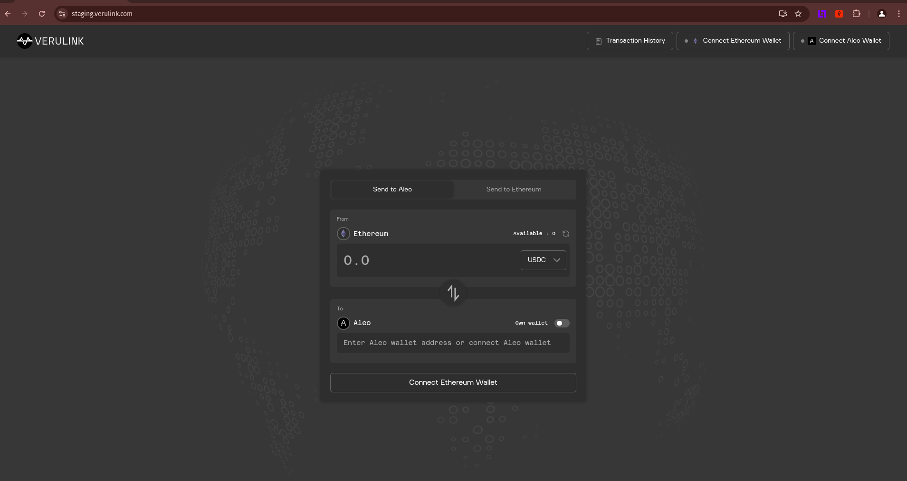

- Connect Metamask as well as Leo Wallet if possible like below:
    
    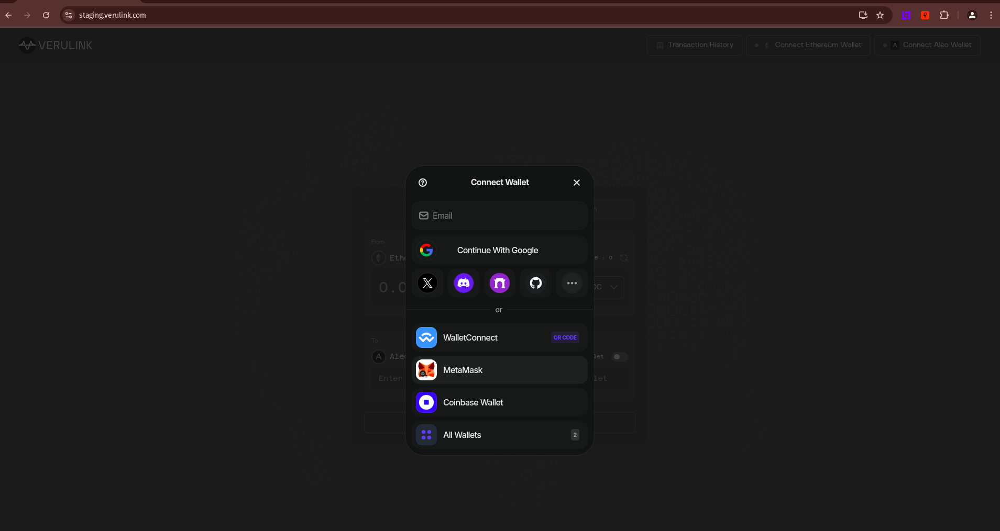
    
    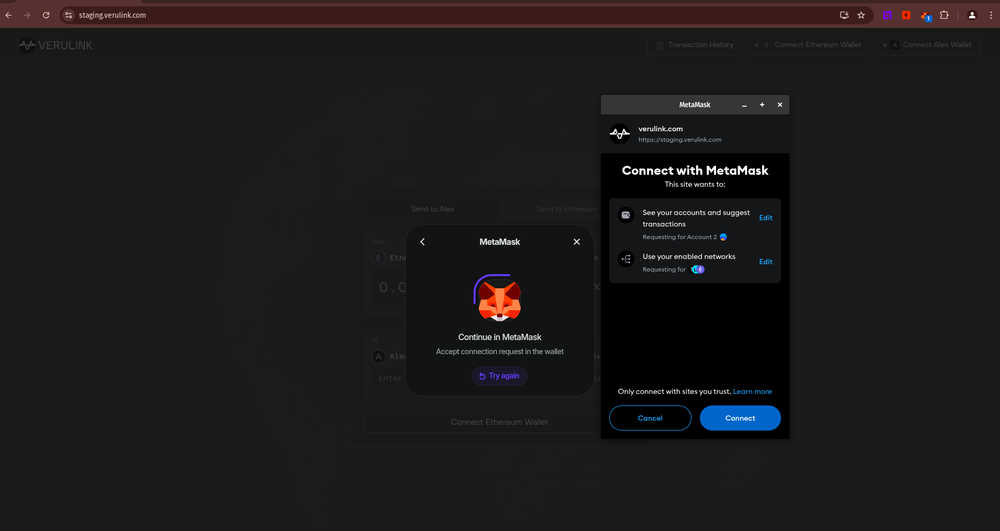

    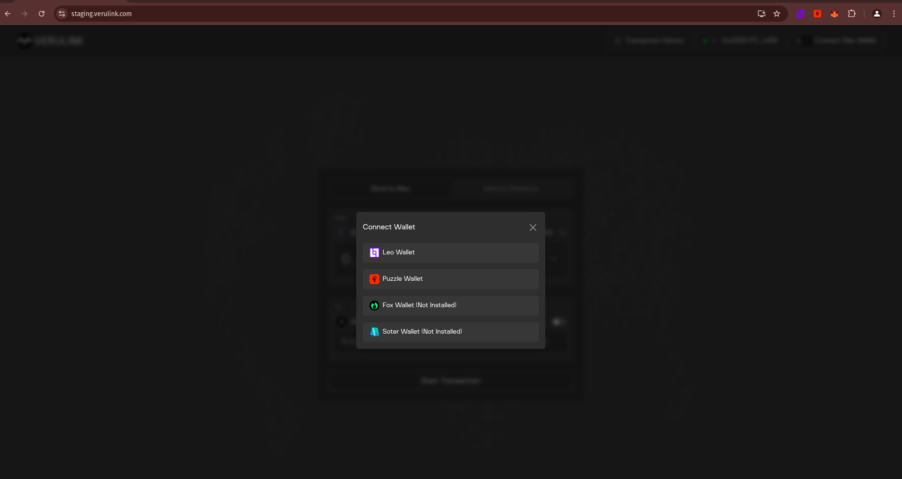

    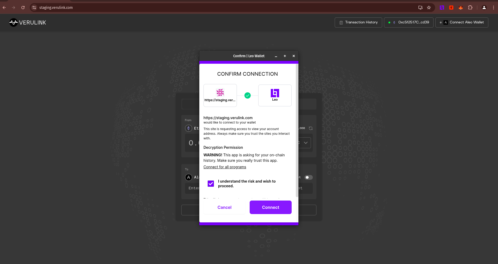


- Once connected, we can start bridging like below:
    
    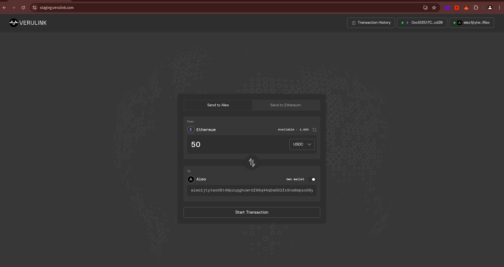

- From above, we can say that we have 1000 USDC and we am sending 50 USDC in Aleo Wallet.
    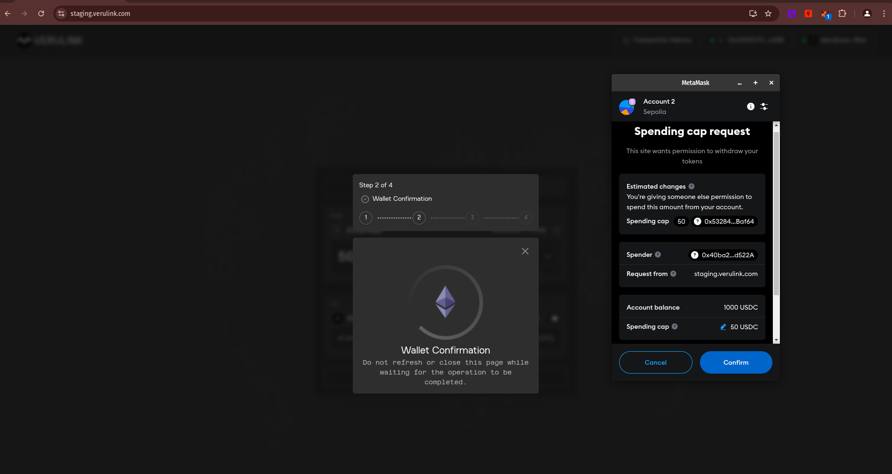
    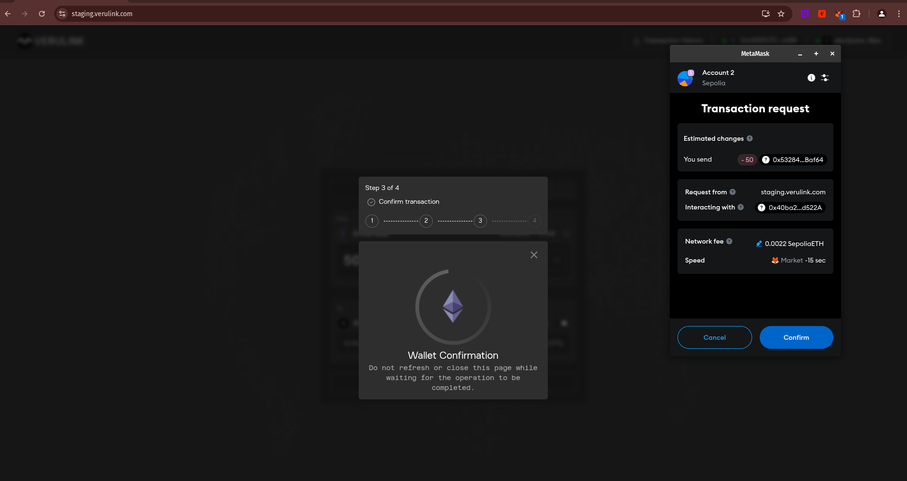
    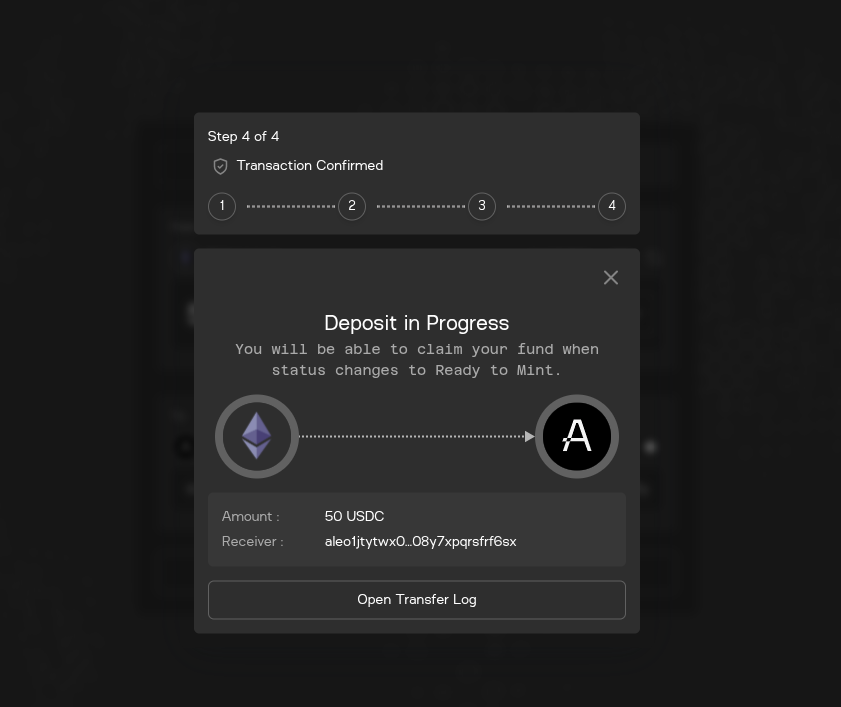
   
    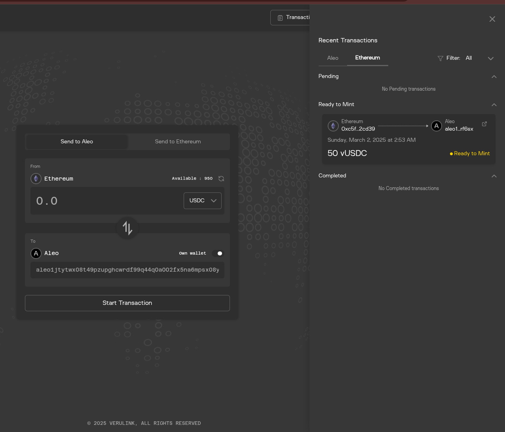

- From above image, we can say that `50 vUSDC` is ready to Mint in Aleo Network. Click on that transaction, something like below will open up:
    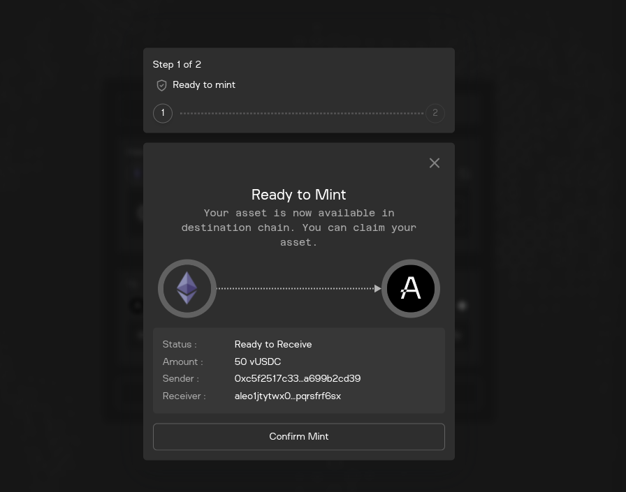
    
    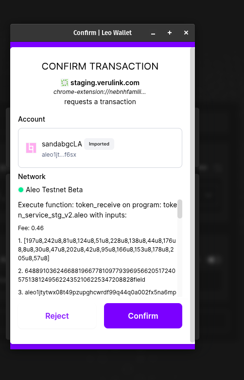

- Once completed, we can see:

    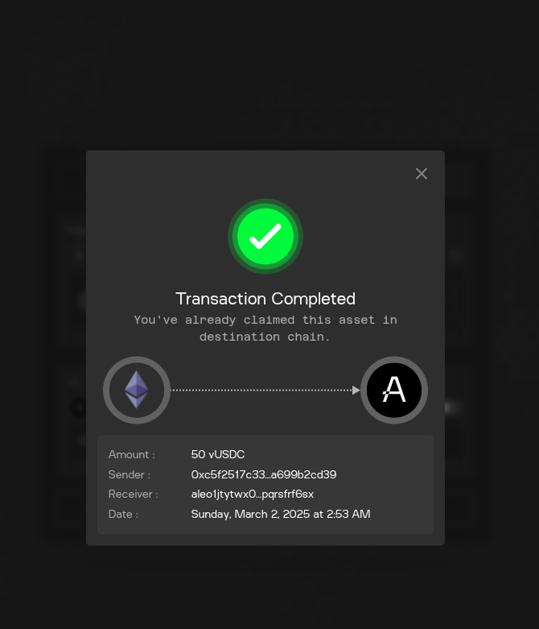

- For me, Transaction ID: `at13e7zu6emmmmfxjk6xkun4dx0mjp8flc90s9pqpudjr2syveffgzqj2rtjd`.
    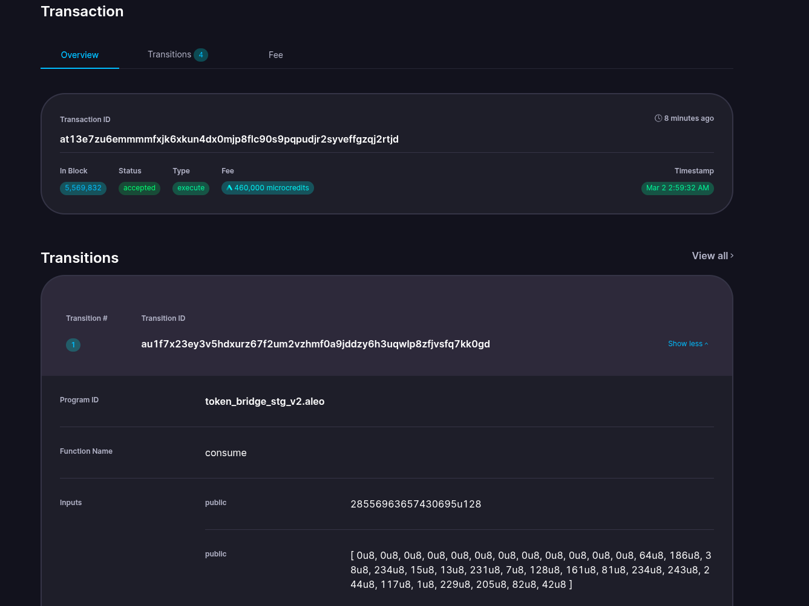

- Here, I transferred 50USDC from ETH Sepolia Network to ALEO Testnet.

# Sign with `Transaction ID`:
- For me, program deployed Transaction ID is: `at13e7zu6emmmmfxjk6xkun4dx0mjp8flc90s9pqpudjr2syveffgzqj2rtjd`. Command:
    ```sh
    leo account sign -d --private-key <redacted> --message "at13e7zu6emmmmfxjk6xkun4dx0mjp8flc90s9pqpudjr2syveffgzqj2rtjd" --raw
    ```
- Output:
    ```sh
    sign1fpvmzc6rqt98gnp38ssly45332whe02gxqdr885hkql3eqz8xgqdhmujp4tzzp3xxrrpxfs28845apqjj3mmfphh73r7zy8ealzr2q9zagrt29qtpw7qxv39ajtn8yxgyk093n6ah79jvpv2l3kfnalnz9kryey36lgje05a8hr7qzv6zl3mgpr6qrkvuvd62hpf0233gahpy06085t
    ```